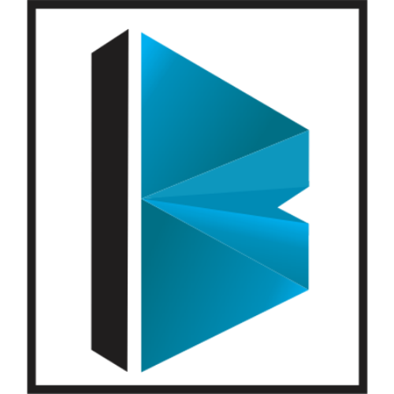
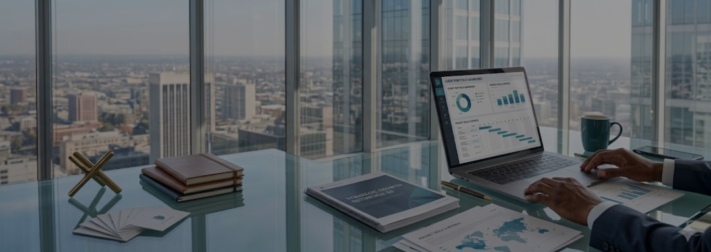

# Braige & Company - Design System & Component Library

This document serves as the comprehensive design system and component guide for the Braige & Company website. It outlines the visual language, architectural patterns, and reusable UI components that ensure a consistent, premium, and highly interactive user experience across all pages, along with the exact code snippets required to replicate them.

---

## 🎨 1. Visual Language & Branding

### 1.1 Typography
The typography is structured to convey professionalism, modernity, and clarity.
*   **Primary Font (Headline & Body):** `Century Gothic Paneuropean` (with fallbacks to standard `Century Gothic`). This sans-serif font provides a geometric, clean, and highly readable look suitable for a high-end corporate advisory firm.
*   **Secondary Fonts:** `Manrope` (for specific robust headings) and `Inter` (as a reliable system fallback).
*   **Icons:** Google **Material Symbols Outlined** configured with a lightweight stroke (`wght: 300/400`) to match the geometric sleekness of the primary typography.

### 1.2 Color Palette
The color system relies on high-contrast pairings, utilizing deep professional teals against extremely clean, soft backgrounds.
*   **Primary Brand (`#0d97be`):** A vibrant cyan/teal used for call-to-actions, primary highlights, icons, and active states.
*   **Secondary Brand (`#0A3B43` & `#0D5D6D`):** Deep, dark teals used for premium sections, footers, and stat cards to ground the design.
*   **Backgrounds:** 
    *   `#FFFFFF` (Pure White) and `#FDFDFD` (Off-white) for main sections.
    *   `#F8FAFC` (Slate-50) and `#f3f4fb` for subtle card and section distinctions.
*   **Text/Typography:**
    *   Headings: `#1a1a1a` to `#191c1d` (Near black for high contrast).
    *   Body/Subtitles: `#4a6367` and `#64748b` (Muted teal/slate grays for softer reading).

### 1.3 Tailwind Configuration
This is the core configuration placed in the `<head>` of every HTML file to establish the brand's primary tokens.

```javascript
tailwind.config = {
  theme: {
    extend: {
      colors: {
        "primary": "#0d97be",
        "secondary": "#0A3B43",
        "surface": "#FFFFFF",
        "background": "#FDFDFD",
        "slate-custom": "#4A5568",
        "on-surface-variant": "#64748b"
      },
      fontFamily: {
        "headline": ["'Century Gothic Paneuropean'", "'Century Gothic'", "Manrope", "sans-serif"],
        "body": ["'Century Gothic Paneuropean'", "'Century Gothic'", "Inter", "sans-serif"],
      },
      borderRadius: {
        "DEFAULT": "0.25rem",
        "lg": "0.5rem",
        "xl": "0.75rem",
        "2xl": "1rem",
        "3xl": "1.5rem",
        "full": "9999px"
      },
    },
  },
}
```

---

## 🧱 2. Core UI Components

The website heavily features modern UI trends, blending **Neumorphism** (soft 3D elements) and **Glassmorphism** (frosted glass overlays).

### 2.1 Neumorphic Cards (Soft UI)
Used in the "Why Choose Braige", "Our Core Values", and "FAQ" sections. 
*   **Design:** These cards appear to extrude from the background using a dual-shadow technique—a dark shadow on the bottom right and a bright white highlight on the top left.
*   **Implementation:** `shadow-[12px_12px_24px_#d1d9e6,-12px_-12px_24px_#ffffff]`
*   **Interaction:** On hover, the shadow spreads and the card lifts (`-translate-y-1`), creating a highly tactile, physical feel.

```html
<div class="bg-white p-6 md:p-8 rounded-[2rem] flex flex-col items-center text-center shadow-[12px_12px_24px_#d1d9e6,-12px_-12px_24px_#ffffff] hover:shadow-[16px_16px_32px_#c5d0e0,-16px_-16px_32px_#ffffff] hover:-translate-y-1 transition-all duration-300 group border border-gray-50">
    <span class="material-symbols-outlined text-primary text-4xl mb-4 group-hover:scale-110 transition-transform duration-300 p-2">handshake</span>
    <h4 class="font-headline text-xl font-bold text-gray-900 mb-3">Card Title</h4>
    <p class="text-sm text-gray-500 leading-relaxed">This is the description text sitting inside the soft neumorphic card component.</p>
</div>
```

### 2.2 Debossed Process Steps (Inset Neumorphism)
Used in the "How We Work" / "Our Process" section.
*   **Design:** Instead of extruding, these cards look pressed *into* the screen, utilizing inset shadows.
*   **Implementation:** `shadow-[inset_4px_4px_8px_rgba(255,255,255,1),inset_-4px_-4px_8px_rgba(0,0,0,0.05),...]`
*   **Icons inside:** The icon containers use a similar inset shadow to create a nested "button" effect.

```html
<div class="bg-[#F8FAFC] px-5 py-8 md:px-6 md:py-10 rounded-[2rem] flex flex-col items-center text-center relative shadow-[inset_4px_4px_8px_rgba(255,255,255,1),inset_-4px_-4px_8px_rgba(0,0,0,0.05),12px_12px_24px_rgba(0,0,0,0.3)] hover:shadow-[inset_4px_4px_8px_rgba(255,255,255,1),inset_-4px_-4px_8px_rgba(0,0,0,0.05),16px_16px_32px_rgba(0,0,0,0.4)] hover:-translate-y-2 transition-all duration-300 group border-none">
    
    <!-- Floating Arrow Overlay -->
    <div class="hidden lg:flex absolute -right-5 top-1/2 transform -translate-y-1/2 w-12 h-12 bg-white/20 backdrop-blur-md rounded-2xl items-center justify-center z-20 shadow-[0_8px_16px_rgba(0,0,0,0.2)] border border-white/50 group-hover:bg-white/30 group-hover:scale-110 transition-all duration-300">
        <span class="material-symbols-outlined text-white text-3xl drop-shadow-[0_0_8px_rgba(255,255,255,0.8)] group-hover:translate-x-1 transition-all duration-300">arrow_forward_ios</span>
    </div>

    <!-- Inner Debossed Icon Container -->
    <div class="w-20 h-20 bg-[#F8FAFC] rounded-3xl flex items-center justify-center mb-6 shadow-[inset_6px_6px_12px_#d1d5db,inset_-6px_-6px_12px_#ffffff] transition-all duration-300 group-hover:-rotate-6 hover:shadow-[inset_8px_8px_16px_#cbd5e1,inset_-8px_-8px_16px_#ffffff]">
        <span class="material-symbols-outlined text-4xl text-primary transition-colors duration-300">groups</span>
    </div>

    <h4 class="font-bold text-xl mb-3 text-gray-900">Process Step</h4>
    <p class="text-gray-500 text-sm leading-relaxed">Description of the process step.</p>
</div>
```

### 2.3 Glassmorphic Elements
Used for overlays, floating badges, and active navigation states.
*   **Design:** Semi-transparent backgrounds with a background blur applied to create a frosted glass effect.
*   **Implementation:** `bg-white/20 backdrop-blur-md border border-white/50`.
*   **Example:** The floating badge on the Homepage Hero. Requires `animate-float` from the CSS file.

```html
<div class="mt-12 w-full bg-[#f3f4fb] p-8 rounded-3xl shadow-[8px_8px_16px_#e2e8f0,-8px_-8px_16px_#ffffff] border border-white/50 text-center animate-float hover:scale-105 transition-all duration-500 relative z-20">
    <div class="flex items-center justify-center gap-2 mb-3">
        <div class="w-14 h-14 rounded-full bg-white shadow-[inset_2px_2px_5px_#e2e8f0,inset_-2px_-2px_5px_#ffffff] flex items-center justify-center text-primary">
            <span class="material-symbols-outlined text-4xl">workspace_premium</span>
        </div>
    </div>
    <div class="text-6xl font-headline font-extrabold text-[#191c1d] leading-none mb-2 tracking-tight">
        <span class="text-primary drop-shadow-sm">10+</span>
    </div>
    <div class="text-xs font-bold text-gray-500 uppercase tracking-[0.2em] leading-relaxed">Years<br />Of Experience</div>
</div>
```

### 2.4 Buttons & Call-to-Actions (CTAs)
*   **Primary Button:** Solid primary color (`bg-primary`), fully rounded (`rounded-full`), white bold text.
*   **Hover State:** Smooth scaling (`transform: scale(1.035)`), accompanied by a diffused drop shadow for a premium lift effect.

```html
<a class="bg-primary text-white px-8 py-3 rounded-full font-bold transition-all inline-block text-center" href="services.html">
    Start Your Project
</a>
```

**Required CSS for Buttons:**
```css
button, a.bg-primary, a[class*="rounded-full"] {
    transition: transform 0.2s ease, box-shadow 0.2s ease, background-color 0.2s ease;
    will-change: transform;
}
button:hover, a.bg-primary:hover, a[class*="rounded-full"]:hover {
    transform: scale(1.035);
    box-shadow: 0 10px 20px rgba(0, 0, 0, 0.15);
}
button:active, a.bg-primary:active, a[class*="rounded-full"]:active {
    transform: scale(0.97);
    box-shadow: 0 4px 8px rgba(0, 0, 0, 0.2);
}
```

### 2.5 Navigation Bar & Active Pills
*   **Active Navigation Pills:** The current active page in the nav bar utilizes a pill-shaped background (`rounded-full bg-primary text-white`) to clearly orient the user.

```html
<nav class="max-w-7xl mx-auto px-4 sm:px-6 flex justify-between items-center">
    <!-- Logo -->
    <a href="index.html" class="logo-link flex items-center gap-3">
        <div class="w-14 h-14 flex items-center justify-center">
            
        </div>
        <span class="hidden sm:inline text-xl font-bold tracking-tight font-headline text-[#333]">BRAIGE &amp; COMPANY</span>
    </a>
    
    <!-- Links -->
    <div class="hidden md:flex items-center space-x-6 text-sm font-semibold text-gray-600">
        <a class="nav-link active" href="index.html">Home</a>
        <a class="nav-link" href="services.html">Services</a>
    </div>
</nav>
```

**Required CSS for Navigation:**
```css
nav .nav-link {
    padding: 0.6rem 0.95rem;
    border-radius: 9999px;
    transition: transform 0.2s ease, color 0.2s ease, background-color 0.2s ease;
    display: inline-flex;
    color: #4b5563;
    text-decoration: none;
}
nav .nav-link:hover {
    transform: translateY(-1.5px);
    color: #0d97be;
    background-color: rgba(13, 151, 190, 0.1);
}
nav .nav-link.active {
    color: white;
    background-color: #0d97be;
    box-shadow: 0 4px 12px rgba(0, 0, 0, 0.15);
}
```

---

## 🖼️ 3. Layout & Section Archetypes

### 3.1 Inner Page Heros
Used on `about.html`, `services.html`, and `contact.html`.
*   **Design:** Full-width imagery with a standardized dark overlay (`bg-black/30`). This replaces the original heavy green tint, allowing full-color professional photography to shine through while keeping the white text highly legible.

```html
<header class="relative h-[480px] flex items-center overflow-hidden bg-slate-100">
    <!-- Image Background -->
    
    
    <!-- Dark Overlay for Readability -->
    <div class="absolute inset-0 bg-black/30"></div>
    
    <!-- Content -->
    <div class="relative max-w-7xl mx-auto px-8 w-full z-10 text-white">
        <h1 class="text-5xl md:text-6xl font-headline font-bold mb-4">Our Services</h1>
        <p class="text-lg opacity-90 max-w-lg mb-8">Comprehensive business solutions tailored to your unique needs.</p>
    </div>
</header>
```

### 3.2 Deep Teal Stat Cards
Used to display counters and statistics, primarily on the homepage. They feature fully responsive typography using CSS media queries.

```html
<div class="stat-card">
    <div class="text-4xl font-bold text-white mb-1 counter" data-target="50">0</div>
    <p>Projects Delivered</p>
</div>
```

**Required CSS for Stat Cards:**
```css
.stat-card {
    background-color: #0D5D6D;
    color: white;
    padding: 1.5rem 1.25rem;
    border-radius: 1rem;
    text-align: left;
}
@media (min-width: 768px) {
    .stat-card { padding: 2.5rem 1.5rem; border-radius: 1.5rem; }
}
.stat-card h3 {
    font-size: 2.5rem;
    font-weight: 800;
    line-height: 1;
    margin-bottom: 0.25rem;
}
@media (min-width: 768px) {
    .stat-card h3 { font-size: 3.5rem; margin-bottom: 0.5rem; }
}
```

### 3.3 Dynamic Service Horizontal Tabs (`services.html`)
*   **Design:** Instead of standard vertical dropdowns, services are presented in a dynamic, one-at-a-time horizontal tab system.
*   **Functionality:** Clicking a tab smoothly fades out the current content and translates the new content into view (`transform translateY`).
*   **Layout:** Content is split into a 12-column grid—5 columns for textual description and features, and 7 columns for a supporting image card.

```html
<!-- Tab Buttons -->
<div class="flex flex-wrap gap-4 justify-center border-b border-transparent pb-4">
    <button class="px-8 py-3 rounded-full font-bold transition-all bg-primary text-white shadow-lg" id="tab-business" onclick="switchTab('business')">Business Advisory</button>
    <button class="px-8 py-3 rounded-full font-bold transition-all bg-white text-gray-600 shadow-md hover:bg-gray-50" id="tab-branding" onclick="switchTab('branding')">Branding</button>
</div>

<!-- Tab Content -->
<div class="bg-[#f3f4fb] rounded-3xl md:rounded-[2.5rem] p-6 md:p-16">
    <div class="service-tab-content active" id="content-business">
        <div class="grid grid-cols-1 lg:grid-cols-12 gap-10 md:gap-16 items-start">
            <div class="lg:col-span-5 space-y-8">
                <h2 class="text-4xl font-headline font-bold text-[#191c1d]">Business Advisory</h2>
                <p>Details about the service.</p>
            </div>
            <div class="lg:col-span-7">
                <div class="service-image-card">
                    
                    <div class="service-image-overlay">
                        <div class="service-image-title">Project Name</div>
                    </div>
                </div>
            </div>
        </div>
    </div>
</div>
```

**Required CSS for Tabs:**
```css
.service-tab-content {
    opacity: 0;
    transform: translateY(10px);
    transition: opacity 0.3s ease, transform 0.3s ease;
}
.service-tab-content.active {
    opacity: 1;
    transform: translateY(0);
}
.service-tab-content.hidden { display: none; }
```

### 3.4 Portfolio Sliders (`about.html`)
*   **Design:** A highly interactive, auto-playing image carousel split by category (Business Advisory, Branding, Engineering).
*   **Functionality:** Built with vanilla JavaScript (`script.js`). Features cross-fade transitions (`opacity-100` to `opacity-0`), auto-play intervals (3 seconds), hover-to-pause logic, and manual navigation dots.
*   **Fallback:** Configured with graceful degradation placeholders if actual project assets are not found.

```html
<div class="relative rounded-[2rem] overflow-hidden shadow-2xl bg-white aspect-[4/3] border border-gray-100 portfolio-slider group/slider" data-current-slide="0" data-auto-play="true">
    <div class="absolute inset-0 z-0 slides-wrapper bg-gray-100">
        <div class="absolute inset-0 transition-opacity duration-1000 ease-in-out opacity-100 slide">
            
        </div>
        <div class="absolute inset-0 transition-opacity duration-1000 ease-in-out opacity-0 slide">
            
        </div>
    </div>
    
    <!-- Controls -->
    <div class="absolute bottom-6 left-0 right-0 flex justify-center gap-3 z-20 dots-container">
        <!-- Dots injected by JS -->
    </div>
</div>
```

**Required Javascript for Sliders (`script.js`):**
```javascript
document.addEventListener('DOMContentLoaded', () => {
    const sliders = document.querySelectorAll('.portfolio-slider');
    
    sliders.forEach(slider => {
        const slides = slider.querySelectorAll('.slide');
        const dotsContainer = slider.querySelector('.dots-container');
        const isAutoPlay = slider.dataset.autoPlay === 'true';
        let currentSlide = parseInt(slider.dataset.currentSlide) || 0;
        let slideInterval;
        
        slides.forEach((_, index) => {
            const dot = document.createElement('button');
            dot.className = `w-2 h-2 rounded-full transition-all duration-300 ${index === currentSlide ? 'bg-white w-6' : 'bg-white/50 hover:bg-white/80'}`;
            dot.setAttribute('aria-label', `Go to slide ${index + 1}`);
            dot.addEventListener('click', () => goToSlide(index));
            dotsContainer.appendChild(dot);
        });

        function goToSlide(index) {
            slides[currentSlide].classList.remove('opacity-100');
            slides[currentSlide].classList.add('opacity-0');
            const dots = dotsContainer.querySelectorAll('button');
            dots[currentSlide].className = 'w-2 h-2 rounded-full transition-all duration-300 bg-white/50 hover:bg-white/80';
            currentSlide = index;
            slides[currentSlide].classList.remove('opacity-0');
            slides[currentSlide].classList.add('opacity-100');
            dots[currentSlide].className = 'w-2 h-2 rounded-full transition-all duration-300 bg-white w-6';
            slider.dataset.currentSlide = currentSlide;
        }

        if (isAutoPlay) {
            const startAutoPlay = () => slideInterval = setInterval(() => goToSlide((currentSlide + 1) % slides.length), 3000);
            const stopAutoPlay = () => clearInterval(slideInterval);
            startAutoPlay();
            slider.addEventListener('mouseenter', stopAutoPlay);
            slider.addEventListener('mouseleave', startAutoPlay);
        }
    });
});
```

### 3.5 Contact Form & FAQ Layout
*   **Layout:** A two-panel overlapping card layout. The left panel contains direct contact info (email, phone, address) with an abstract blurred background element. The right panel houses the interactive input form.
*   **Inputs:** Clean, minimalistic input fields with `focus:ring-2 focus:ring-primary` for accessibility and clear state changes.

---

## ⚡ 4. Animations & Micro-Interactions

*   **Floating Elements (`animate-float`):** A custom CSS keyframe animation that translates elements up and down over a 6-second infinite loop to create a dynamic, "breathing" webpage.
*   **Staggered Loading (`stagger-1`, `stagger-2`, etc.):** Used within scroll animations (like the portfolio sliders) to ensure elements load sequentially rather than all at once, creating a cascading effect.

### 4.1 Scroll Animation System (`scroll-animate`)
Elements fade in and slide up slightly as they enter the viewport. Powered by the IntersectionObserver API in `script.js`.

**HTML:**
```html
<div class="scroll-animate stagger-1">Content</div>
<div class="scroll-animate stagger-2">Content</div>
```

**CSS (`styles.css`):**
```css
@keyframes premiumFadeInUp {
    0% { opacity: 0; transform: translateY(40px) scale(0.98); filter: blur(8px); }
    100% { opacity: 1; transform: translateY(0) scale(1); filter: blur(0); }
}

.scroll-animate {
    opacity: 0;
    transform: translateY(40px) scale(0.98);
    filter: blur(8px);
}
.scroll-animate.animate {
    animation: premiumFadeInUp 1s cubic-bezier(0.16, 1, 0.3, 1) forwards;
}

.stagger-1 { animation-delay: 80ms; }
.stagger-2 { animation-delay: 160ms; }
.stagger-3 { animation-delay: 240ms; }
```

**JavaScript (`script.js`):**
```javascript
const observerOptions = { root: null, rootMargin: '0px', threshold: 0.15 };
const observer = new IntersectionObserver((entries, observer) => {
    entries.forEach(entry => {
        if (entry.isIntersecting) {
            entry.target.classList.add('animate');
            observer.unobserve(entry.target);
        }
    });
}, observerOptions);

document.querySelectorAll('.scroll-animate').forEach((element) => {
    observer.observe(element);
});
```

### 4.2 Dynamic Number Counters (`counter`)
Statistics in the "Why Choose Braige" section count up from 0 to their target number dynamically when scrolled into view.

**HTML:**
```html
<div class="counter" data-target="100">0</div>
```

**JavaScript (`script.js`):**
```javascript
function animateValue(obj, start, end, duration) {
    let startTimestamp = null;
    const step = (timestamp) => {
        if (!startTimestamp) startTimestamp = timestamp;
        const progress = Math.min((timestamp - startTimestamp) / duration, 1);
        const easeOutQuart = 1 - Math.pow(1 - progress, 4);
        obj.innerHTML = Math.floor(easeOutQuart * (end - start) + start);
        if (progress < 1) window.requestAnimationFrame(step);
    };
    window.requestAnimationFrame(step);
}
```

---

## 📱 5. Responsive Strategy (Mobile-First)
The architecture utilizes Tailwind's mobile-first breakpoints (`sm:`, `md:`, `lg:`, `xl:`).
*   **Grids:** Layouts gracefully collapse from 4-columns or 3-columns on desktop to single columns on mobile devices (e.g., `grid-cols-1 sm:grid-cols-2 lg:grid-cols-4`).
*   **Padding/Margins:** Heavy use of responsive spacing (e.g., `p-6 md:p-12`, `gap-4 md:gap-8`) ensures that while the desktop view feels airy and premium, the mobile view remains tight, proportionate, and requires minimal scrolling.
*   **Typography:** Headers scale dynamically (e.g., `text-4xl md:text-5xl`) to prevent text wrapping issues on small screens.
